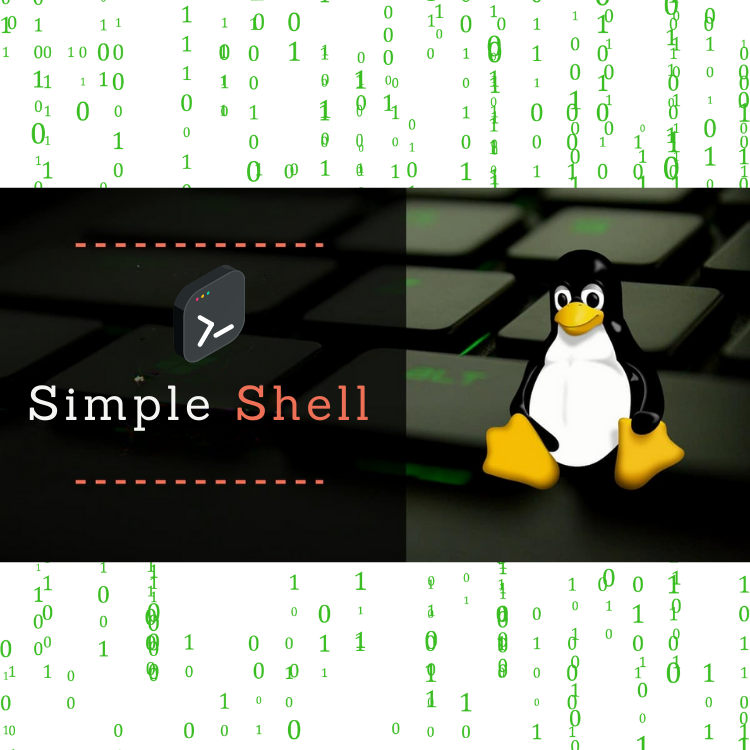

<div align="center">
<br>



</div>


<p align="center">


</p>


<h1 align="center"> C - Simple Shell </h1>


<h3 align="center">
<a href="https://github.com/RazikaBengana/holbertonschool-simple_shell#eye-about">About</a> •
<a href="https://github.com/RazikaBengana/holbertonschool-simple_shell#hammer_and_wrench-tasks">Tasks</a> •
<a href="https://github.com/RazikaBengana/holbertonschool-simple_shell#memo-learning-objectives">Learning Objectives</a> •
<a href="https://github.com/RazikaBengana/holbertonschool-simple_shell#computer-requirements">Requirements</a> •
<a href="https://github.com/RazikaBengana/holbertonschool-simple_shell#bulb-more-info">More Info</a> •
<a href="https://github.com/RazikaBengana/holbertonschool-simple_shell#package-installation">Installation</a> •
<a href="https://github.com/RazikaBengana/holbertonschool-simple_shell#keyboard-basic-usage">Basic usage</a> •
<a href="https://github.com/RazikaBengana/holbertonschool-simple_shell#mag_right-resources">Resources</a> •
<a href="https://github.com/RazikaBengana/holbertonschool-simple_shell#bust_in_silhouette-authors">Authors</a> •
<a href="https://github.com/RazikaBengana/holbertonschool-simple_shell#octocat-license">License</a>
</h3>

---

<!-- ------------------------------------------------------------------------------------------------- -->

<br>
<br>

## :eye: About

<br>

<div align="center">

**`C - simple shell`** project is a collaborative effort to recreate a **command-line interpreter** for Unix-like operating systems.
<br>
The programs support built-in commands like `exit` to quit the shell and `env` to print environment variables, as well as the ability to execute other commands found in the system's `PATH`.
<br>
<br>
This project has been created by [**Holberton School**](https://www.holbertonschool.com/about-holberton) to enable every student to understand how `shell programs` in C language work.

</div>

<br>
<br>

### Background Context

<br>

Write a simple `UNIX` command interpreter.

<br>
<br>

<!-- ------------------------------------------------------------------------------------------------- -->

## :hammer_and_wrench: Tasks

<br>

**`0. README, man, AUTHORS`**

**`1. Betty would be proud`**

**`2. Simple shell 0.1`**

**`3. Simple shell 0.2`**

**`4. Simple shell 0.3`**

**`5. Simple shell 0.4`**

**`6. Simple shell 1.0`**

**`7. What happens when you type 'ls -l *.c' in the shell`** 

**`8. Test suite`**

**`9. Simple shell 0.1.1`**

**`10. Simple shell 0.2.1`**

**`11. Simple shell 0.4.1`**

**`12. Simple shell 0.4.2`**

**`13. setenv, unsetenv`**

**`14. cd`**

**`15. ;`**

**`16. && and ||`**

**`17. alias`**

**`18. Variables`**

**`19. Comments`**

**`20. help`**

**`21. history`**

**`22. File as input`**

<br>
<br>

<!-- ------------------------------------------------------------------------------------------------- -->

## :memo: Learning objectives

<br>

**_You are expected to be able to [explain to anyone](https://fs.blog/feynman-learning-technique/), without the help of Google:_**

<br>

```diff

General

+ Who designed and implemented the original Unix operating system

+ Who wrote the first version of the UNIX shell

+ Who invented the B programming language (the direct predecessor to the C programming language)

+ Who is Ken Thompson

+ How does a shell work

+ What is a pid and a ppid

+ How to manipulate the environment of the current process

+ What is the difference between a function and a system call

+ How to create processes

+ What are the three prototypes of main

+ How does the shell use the PATH to find the programs

+ How to execute another program with the execve system call

+ How to suspend the execution of a process until one of its children terminates

+ What is EOF / “end-of-file”?

```

<br>
<br>

<!-- ------------------------------------------------------------------------------------------------- -->

## :computer: Requirements

<br>

```diff

General

+ Allowed editors: vi, vim, emacs

+ All your files will be compiled on Ubuntu 20.04 LTS using gcc, using the options -Wall -Werror -Wextra -pedantic -std=gnu89

+ All your files should end with a new line

+ A README.md file, at the root of the folder of the project is mandatory

+ Your code should use the Betty style. It will be checked using betty-style.pl and betty-doc.pl

+ Your shell should not have any memory leaks

+ No more than 5 functions per file

+ All your header files should be include guarded

+ Use system calls only when you need to

```

<br>

- [Why do you need to use system calls only when you need to ?](https://www.quora.com/Why-are-system-calls-expensive-in-operating-systems)

<br>

**_Why all your files should end with a new line? See [HERE](https://unix.stackexchange.com/questions/18743/whats-the-point-in-adding-a-new-line-to-the-end-of-a-file/18789)_**

<br>
<br>

### GitHub

<br>

There should be one project repository per group. <br>
If you clone/fork/whatever a project repository with the same name before the second deadline, you risk a 0% score.

<br>
<br>

<!-- ------------------------------------------------------------------------------------------------- -->

## :bulb: More Info

<br>

### Output:

<br>

- Unless specified otherwise, your program **must have the exact same output** as `sh` (`/bin/sh`) as well as the exact same error output.

  - The only difference is when you print an error, the name of the program must be equivalent to your `argv[0]` (See below).

<br>
<br>

- Example of error with `sh`:

<br>

```yaml
$ echo "qwerty" | /bin/sh
/bin/sh: 1: qwerty: not found

$ echo "qwerty" | /bin/../bin/sh
/bin/../bin/sh: 1: qwerty: not found
$
```

<br>
<br>

- Same error with your program `hsh`:

<br>

```yaml
$ echo "qwerty" | ./hsh
./hsh: 1: qwerty: not found

$ echo "qwerty" | ./././hsh
./././hsh: 1: qwerty: not found
$
```

<br>
<br>

### List of allowed functions and system calls:

<br>

- all functions from `string.h`
- `access` (`man 2 access`)
- `chdir` (`man 2 chdir`)
- `close` (`man 2 close`)
- `closedir` (`man 3 closedir`)
- `execve` (`man 2 execve`)
- `exit` (`man 3 exit`)
- `_exit` (`man 2 _exit`)
- `fflush` (`man 3 fflush`)
- `fork` (`man 2 fork`)
- `free` (`man 3 free`)
- `getcwd` (`man 3 getcwd`)
- `getline` (`man 3 getline`)
- `getpid` (`man 2 getpid`)
- `isatty` (`man 3 isatty`)
- `kill` (`man 2 kill`)
- `malloc` (`man 3 malloc`)
- `open` (`man 2 open`)
- `opendir` (`man 3 opendir`)
- `perror` (`man 3 perror`)
- `printf` (`man 3 printf`)
- `fprintf` (`man 3 fprintf`)
- `vfprintf` (`man 3 vfprintf`)
- `sprintf` (`man 3 sprintf`)
- `putchar` (`man 3 putchar`)
- `read` (`man 2 read`)
- `readdir` (`man 3 readdir`)
- `signal` (`man 2 signal`)
- `stat` (__xstat) (`man 2 stat`)
- `lstat` (__lxstat) (`man 2 lstat`)
- `fstat` (__fxstat) (`man 2 fstat`)
- `strtok` (`man 3 strtok`)
- `wait` (`man 2 wait`)
- `waitpid` (`man 2 waitpid`)
- `wait3` (`man 2 wait3`)
- `wait4` (`man 2 wait4`)
- `write` (`man 2 write`)

<br>
<br>

### Compilation:

<br>

- Your shell will be compiled this way:

<br>

```yaml
gcc -Wall -Werror -Wextra -pedantic -std=gnu89 *.c -o hsh
```

<br>
<br>

### Testing:

<br>

- Your shell should work like this in interactive mode:

<br>

```yaml
$ ./hsh
($) /bin/ls
hsh main.c shell.c
($)
($) exit
$
```

<br>
<br>

- But also in non-interactive mode:

<br>

```yaml
$ echo "/bin/ls" | ./hsh
hsh main.c shell.c test_ls_2
$
$ cat test_ls_2
/bin/ls
/bin/ls
$
$ cat test_ls_2 | ./hsh
hsh main.c shell.c test_ls_2
hsh main.c shell.c test_ls_2
$
```

<br>
<br>

### Checks:

<br>

The Checker will be released at the end of the project (1-2 days before the deadline).

We strongly encourage the entire class to work together to create a suite of checks covering both regular tests and edge cases for each task.

See `task 8. Test suite`.

After the deadline, you will need to fork the repository if it’s not on your Github account to be able to be corrected by the checker.

<br>
<br>

<!-- ------------------------------------------------------------------------------------------------- -->

## :package: Installation

<br>
<br>
 
- Clone the repository, and navigate to the project directory: 

<br>

```yaml
git clone https://github.com/RazikaBengana/holbertonschool-simple_shell.git
```

<br>

- To set up the `simple shell`, you need to compile the source files using [GCC](https://www.guru99.com/c-gcc-install.html)

  - This will create an executable file named `hsh` in the project directory:

<br>

```yaml
gcc -Wall -Werror -Wextra -pedantic -std=gnu89 *.c -o hsh
```

<br>
<br>

<!-- ------------------------------------------------------------------------------------------------- -->

## :keyboard: Basic usage

<br>
<br>

**You can run the shell in two modes: `interactive` and `non-interactive`**.

<br>

### `Interactive Mode`: 

<br>

- Start the shell by executing the `hsh` file

  - You will see a **prompt** where you can type commands:

<br>

```yaml
$ ./hsh
($) /bin/ls
hsh main.c shell.c
($) exit
```

<br>
<br>

### `Non-Interactive Mode`: 

<br>

- You can also **pipe** commands into the shell or redirect input from a file:

<br>

```yaml
$ echo "/bin/ls" | ./hsh
hsh main.c shell.c
```

<br>

```yaml
$ cat commands.txt | ./hsh
hsh main.c shell.c
```

<br>
<br>
<br>

:flashlight: **In both modes, the shell supports built-in commands like `exit` and `env`, as well as executing any command available in the system's `PATH`**.

<br>
<br>

<!-- ------------------------------------------------------------------------------------------------- -->

## :mag_right: Resources

<br>

**_Do you need some help?_**

<br>

**Concepts:**

* [Approaching a Project](https://drive.google.com/file/d/14waaG6PYBduJcE2WSnmb4_fOXw02cDh0/view?usp=sharing)

* [Everything you need to know to start coding your own shell](https://drive.google.com/file/d/14rxsef9UaXsgqpM7we0njw3PseOCTvZN/view?usp=sharing)

<br>

**Read or watch:**

* [Unix shell](https://en.wikipedia.org/wiki/Unix_shell)

* [Thompson shell](https://en.wikipedia.org/wiki/Thompson_shell)

* [Ken Thompson](https://en.wikipedia.org/wiki/Ken_Thompson)

<br>

**`man` or `help`:**

* `sh` (Run `sh` as well)

<br>
<br>

<!-- ------------------------------------------------------------------------------------------------- -->

## :bust_in_silhouette: Authors

<br>

**${\color{blue}Chong Leang \space Ueng}$** ---> `Github` : [ChongLeang UENG](https://github.com/ChongLeangUENG)

**${\color{blue}Razika \space Bengana}$**

<br>
<br>

<!-- ------------------------------------------------------------------------------------------------- -->

## :octocat: License

<br>

```C - simple shell``` _project has no license specified._

<br>
<br>

---

<p align="center"><br>2022</p>